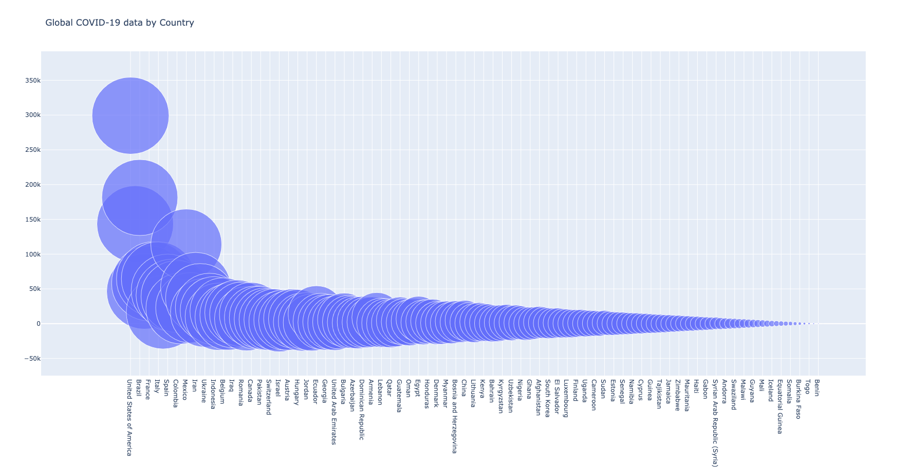
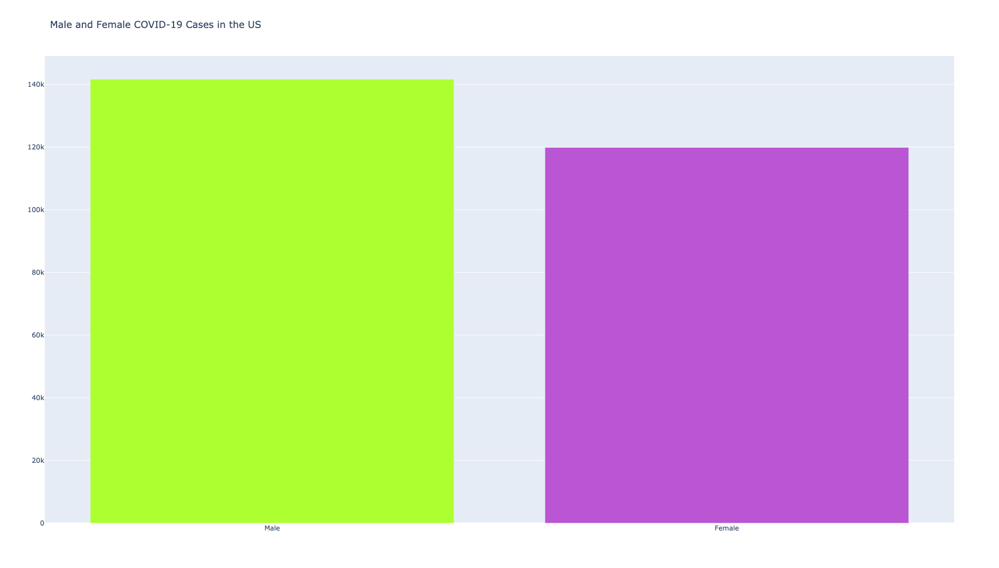
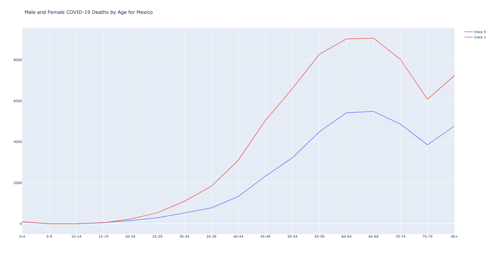
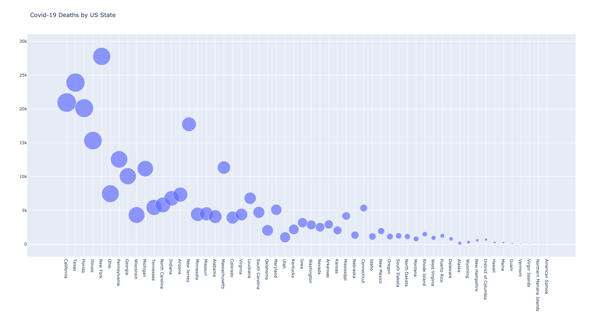
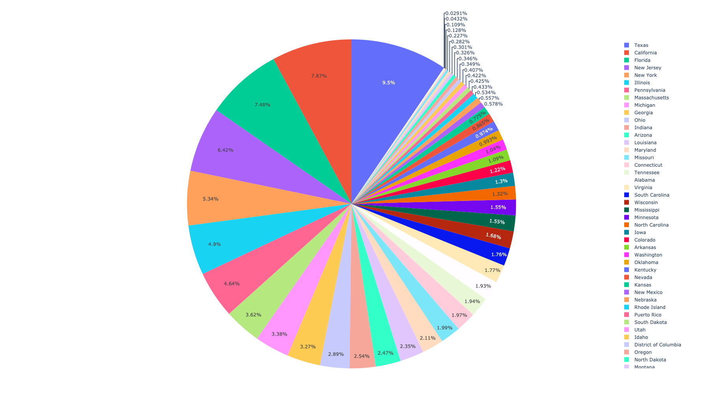

# SI 206 Final Project - COVID Gender API Project #

## Link to GitHub Repo ###

https://github.com/emmiewells/SI206-FINAL

## Our Purpose ##

Ever wondered if there was ever a connection between COVID-19 deaths and gender? Or perhaps which age group is more vulnerable to COVID-19? These are questions that interested us and so we decided to pursue them in this project. We obtained data from several API sources to find out whether or not gender really plays a role in COVID deaths in both the United States and the rest of the world.

## Main Question/Goals ##

In the top countries with the highest COVID-19 deaths, is there a clear gender difference in the deaths? We sought to answer this specific question.

## Disclaimer ##

It's important to know before proceeding that unfortunately, many countries do not provide gender data on COVID cases and deaths, specifically countries like Brazil and India, which makes the process itself challenging so please take this with a grain of salt.

Also understand that this data does not account for transgender or non-binary people. There are attempts made to find this data in the form of including deaths and cases of people whose gender is listed as "unknown", but it's still sorely lacking.

## Resources ##

We used three main APIs with an additional API for more additional help. The APIs used include 

- The SODA API that is used by the Center for Disease Control and Prevention
  - This API provided COVID gender and age group data for the United States specifically
- Global Health API used by the Sex, Gender, and COVID-19 Project
  - This API provided COVID gender and age group data on many countries throughout the world
- Global COVID data provided by the Coronavirus COVID19 API
  - This API provided general COVID data on every country along with global data on all countries put together.
- *Additionally* We also worked with the COVIDAPI Tracking Project to get general data on the US along with US States but this ended up being less than 100 items so we don't count it as one of our main visualizations
- Furthermore, we used Plotly to generate our graphs and visualizations for the project

## Problems Faced ##

We encountered a couple of problems with what should have been a more straightforward project, specifically with understanding how to input 25 items per run for the first 100 elements in the table in the database. This was a challenge that we struggled with but in the end we believe we made it work.

Another problem we faced was with working with the version control system Git, especially when working on the project together at the same time, we kept running into merge conflicts, accidentally creating new branches, or misunderstanding error codes which resulted in delaying the project by quite a bit.

## Instructions for Running Code ##

1. The first thing to do after the code is unzipped is to open the main.py file and run it.

2. You will see a prompt in your terminal asking what you would like to do. Press **1** and then *Enter* to 'Create Database'.

3. The program should loop and again prompt you for what you would like to do. Next, press **2** and then *Enter* to 'Update database'.

4. Then you will enter into a new prompt interface asking which tables to update. There is a specific order to insert the data into the databases.
   1. Press **1** and then *Enter* to update the *Global and USA tables*. ***Only press this once***
   2. Then, press **2** and then *Enter* to update the *USA State table*. ***Run this 3 and only 3 times***
   3. Finally, after you've filled the *States* table above and see the prompt, press **3** and then *Enter* to update every other table. You will need to do this ***at least 14 times in a row***
   4. After doing all of this, press **0** and then *Enter* to exit out of that prompt to return to the main prompt interface. All of the tables should be ready do go now.

5. Now that the tables are ready, and you are on the main prompt, we can calculate the data. Press **3** and then *Enter* to *Calculate results* and it will generate a file called "covid.txt" which will display the calculated results.
6. Finally, press **4** and then *Enter* to *Plot data*, which will plot all of our visualizations into the browser to be seen.

## Our Calculations ##

Our calculation file called "covid.txt" calculated the global COVID results of the day the program was run, along with general COVID data on every US state, and then calculates the gender COVID data on the United States.

We then went onto calculate the percentage of the second highest COVID country that offers gender data (as other countries such as India and Russia to not provide gender data), and finds the distribution between gender and age groups.

The contents of the file are here:

### covid.txt ###

 	### Global COVID Calculations ###
	The country with the highest COVID case count is United States of America, with a total case count of 16,253,219, accounting for about 22% of all cases in the world!

	The country with the highest COVID death count is United States of America, with a total death count of 299,168, accounting for 19% of all death.

	The country with the highest COVID recovery count is India, with a total recovery count of 9,388,159, accounting for 20% of all recoveries in the world!

	### US State COVID Calculations ###

	Out of all of the US States, the state with the highest COVID cases is California with 1,551,766 cases, which make up about 10% of all cases countrywide.

	Thus far, the deadliest US state is New York with 27,785 deaths, which account for 10% of all deaths.

	But on the lighter side, the state with the most amount of recoveries is Texas with 1,176,377 total recovered and 19% of all recoveries!

	### USA Gender Data ###

	In the US alone, men are dying at alarmingly higher rates than women, accounting for roughly 54% of all deaths right now. Women only make up about 46%.
	In terms of age group between the genders, the overall most vulnerable group to COVID are ages between 85 years and over.
	Men however typically die a bit younger with their most vulnerable age group of 75-84 years taking the most amount of deaths while women are typically more vulnerable around 85 years and over.
	Furthermore, we decided to compare COVID deaths with deaths of other and similar conditions that it is consistently compared to, for example Pneumonia and Influenza. For all of America, COVID19 and Pneumonia deaths are roughly equal and account for about 10% of all deaths while the flu accounts for only about 0.25% of all *reported* related deaths thus far this year. Men tend to die from COVID 10% of the time compared to pneumonia and the flu while women tend to die from COVID 9% of the time.

	### Global Gender Data ###

	Unfortunately, for a lot of countries, the gender distribution data is not provided. So take this data with a grain of salt.
	In terms of gender data, the highest COVID count providing this data is Mexico, besides the United States. There, men account for 64% of all COVID deaths so far with females accounting for only 36%. That's quite alarming.
	However, strangely enough, women make up the majority of the population at 51%, outnumbering men who make up only 49%

	What is perhaps even more surprising, we looked at the age groups between men and women to see if there was a gender difference here.

	Age Group: 0-4, Female Deaths: 95, Male Deaths: 102, Male Death Percentage: 52.0%, Female Death Percentage: 48.0%

	Age Group: 15-19, Female Deaths: 63, Male Deaths: 53, Male Death Percentage: 46.0%, Female Death Percentage: 54.0%

	Age Group: 20-24, Female Deaths: 156, Male Deaths: 232, Male Death Percentage: 60.0%, Female Death Percentage: 40.0%

	Age Group: 25-29, Female Deaths: 297, Male Deaths: 535, Male Death Percentage: 64.0%, Female Death Percentage: 36.0%

	Age Group: 30-34, Female Deaths: 528, Male Deaths: 1099, Male Death Percentage: 68.0%, Female Death Percentage: 32.0%

	Age Group: 35-39, Female Deaths: 777, Male Deaths: 1833, Male Death Percentage: 70.0%, Female Death Percentage: 30.0%

	Age Group: 40-44, Female Deaths: 1335, Male Deaths: 3108, Male Death Percentage: 70.0%, Female Death Percentage: 30.0%

	Age Group: 45-49, Female Deaths: 2330, Male Deaths: 5047, Male Death Percentage: 68.0%, Female Death Percentage: 32.0%

	Age Group: 50-54, Female Deaths: 3226, Male Deaths: 6604, Male Death Percentage: 67.0%, Female Death Percentage: 33.0%

	Age Group: 55-59, Female Deaths: 4497, Male Deaths: 8282, Male Death Percentage: 65.0%, Female Death Percentage: 35.0%

	Age Group: 60-64, Female Deaths: 5426, Male Deaths: 9031, Male Death Percentage: 62.0%, Female Death Percentage: 38.0%

	Age Group: 65-69, Female Deaths: 5491, Male Deaths: 9071, Male Death Percentage: 62.0%, Female Death Percentage: 38.0%

	Age Group: 70-74, Female Deaths: 4867, Male Deaths: 8027, Male Death Percentage: 62.0%, Female Death Percentage: 38.0%

	Age Group: 75-79, Female Deaths: 3858, Male Deaths: 6082, Male Death Percentage: 61.0%, Female Death Percentage: 39.0%

	Age Group: 80+, Female Deaths: 4782, Male Deaths: 7247, Male Death Percentage: 60.0%, Female Death Percentage: 40.0%

	The differences in death are quite shocking.

## Visualizations ##

We created several visualizations based off the calculations done. 

We first calculated in general the countries with the highest COVID-19 cases in the world, the top of which is the United States. We made our visualization here. 

We then calculated the cases comparison between men and women deaths in the United States and discovered men die at much higher percentages than women.

And finally we went onto calculate the deaths in Mexico, the second most COVID country that offered gender data and determined that men were dying at even higher rates than women.

An additional graph we did involving US State deaths from biggest to smallest using bubbles!

However it's important to note that data from a different API has slightly different results on US States that we thought we'd include as well, in part to show multiple perspectives but also to understand how different COVID APIs are to each other.

## Documentation ##

This is the code documentation for every single function that we used in this project. 

### main.py ###

def main():
    """this is the main function for running everything in the project. Follow the instructions in the readme for how to accomplish this.
    """

### database.py ###

	def create_databases():
    	"""this creates the tables for the entire database
    """

	def retrieve_data(url):
		"""retrieves data from API

	Args:
		url (string): the url for the API

	Returns:
		dictionary: JSON data as a dictionary
	"""

	def save_usa_data():
    """this function specifically saves USA COVID data into a single row table
    """

	def save_usa_state_data():
    """this function saves specific USA state COVID data into a multi-row table
    """

	def save_usa_gender_data():
    """this function populates gender COVID data for the entire United States along with comparisons to other illnesses
    """

	def save_usa_state_gender_data():
    """this function saves Gender COVID data for every individual US State as well as the territories
    """

	def save_countries_age_gender():
    """this function saves gender data on multiple countries around the world, in particular COVID deaths by country, and also the age groups of the deaths. Note that not every country has offered data on this
    """

	def save_global_data():
    """this function inserts current global COVID data in total
    """

	def save_country_data():
    """
    this function saves current COVID data on individual countries that offer that data
    """

	def save_countries_gender():
    """this function saves saves general COVID gender deaths for every country, rather than age groups
    """

### calculate.py ###

	def calculate_global_data():
    """this in general calculates global data
    """

	def calculate_usa_data():
    """this calculates general COVID data in the US
    """

	def calculate_usa_gender_data():
    """this calculates the gender distribution of COVID deaths in the US.
    """

	def calculate_countries_gender_data():
    """this generates the information on the country besides the US with the most COVID cases according to the data and finds out whether men or women die more
    """

### visualizations.py ###

	def main():
    """this will generate visualizations of the data we fetched from the database
    """

